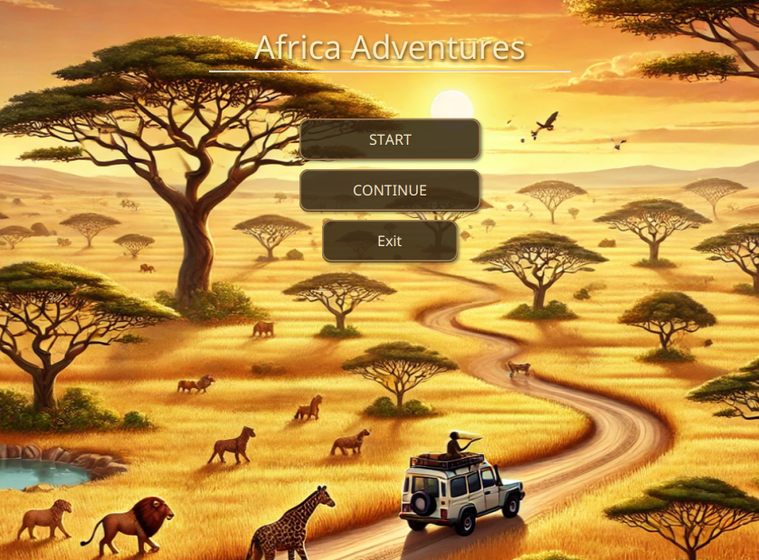
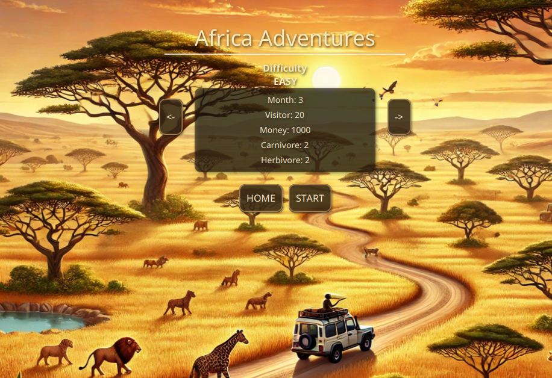
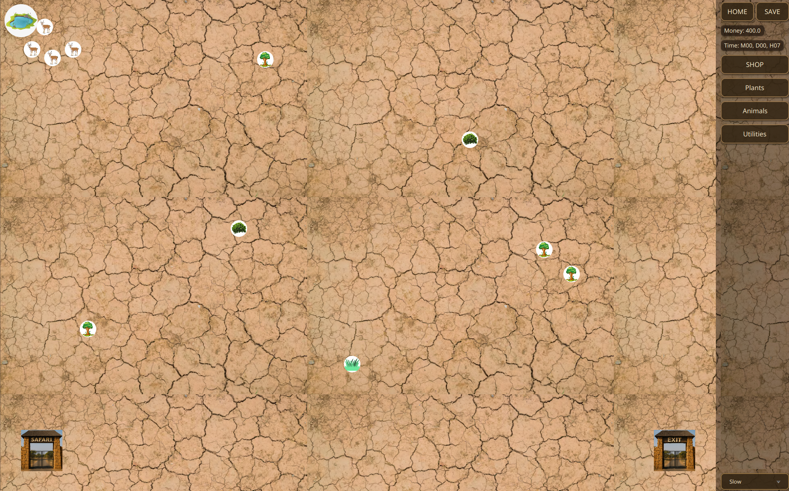
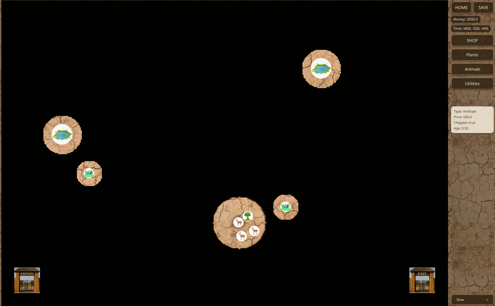
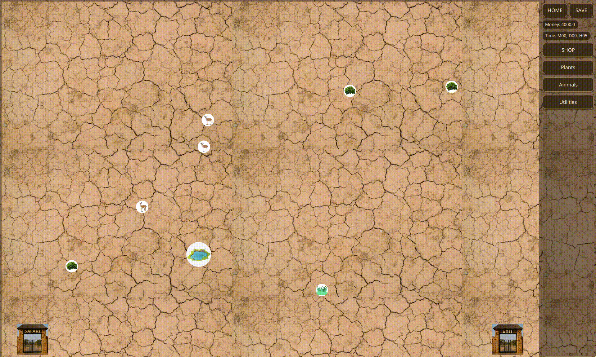

# Africa Adventures

A safari tycoon game written in Java, built from scratch without a game engine (plain Java and JavaFX).

You manage an African safari park: buy animals and plants, build roads for tourist jeeps, set the ticket price, and protect your wildlife from poachers. You need to keep the park both profitable and alive long enough to reach the goals of the difficulty level you picked.

This is a group project made for the **Software Engineering** course.

## Screenshots

<table>
  <tr>
    <td></td>
    <td></td>
  </tr>
  <tr>
    <td></td>
    <td></td>
  </tr>
</table>

## Gameplay

<p align="center">
  
</p>

## My contribution

This was a team project of 3. My main areas were:

- **User interface:** built the JavaFX views and scenes for the game
- **Animal life cycle:** implemented aging and reproduction logic for animals
- **Day and night cycle:** implemented the time-of-day changes
- **Plant life cycle:** implemented how plants are eaten and regrow over time

## Key features

### Building the park
- **Shop with three categories:**
    - **Plants:** Grass (\$100), Bush (\$200), Tree (\$300)
    - **Animals:** Antelope (\$600), Zebra (\$700), Cheetah (\$800), Lion (\$1200)
    - **Utilities:** Road (\$250), Jeep (\$500), Pond (\$1000), Ranger (\$1500)
- **Randomly generated starting map:** each new game begins with some ponds and plants already placed.
- **Road network:** build roads piece by piece from the entrance gate to the exit gate. Roads are stored as a graph, and the game finds every possible route through it.

### Living ecosystem
- **Herbivores** (antelope, zebra) find and remember plants and ponds they see, then come back to eat and drink.
- **Carnivores** (lion, cheetah) hunt herbivores in their field of vision.
- **Plants and ponds are limited resources:** plants are eaten and slowly regrow, and ponds drain as animals drink.
- **Herd behavior:** animals of the same species form groups around a leader and move together.
- **Life cycle:** animals age, reproduce once mature, and die of old age.

### Tourists and economy
- **Tourist groups** arrive at the entrance in random sizes and at random intervals. They are split into jeeps (up to 4 people each) and queued.
- **Jeep safaris:** each jeep takes a random route from the entrance to the exit, then returns along the shortest route.
- **Satisfaction system:** the more animals and the more species tourists see, the happier they are. Higher satisfaction brings tourists more often, and a high ticket price lowers it.
- **Adjustable ticket price:** click a gate to set the ticket price with a slider.
- **Selling and chipping animals:** select an animal, then press **S** to sell it for half its price, or **C** to fit it with a tracking chip (\$500).

### Poachers and rangers
- **Poachers** appear on the map, capture animals, and try to escape with them across the edge of the map. They are only visible when a ranger is nearby.
- **Rangers** patrol the park and fight poachers they come across. Each poacher defeated earns a $2000 bounty.
- **Targeting:** select a ranger, then click a poacher or an animal to give it as a target. Animals culled by a ranger earn 75% of their price.
- Rangers are paid a monthly salary.

### Time, day and night
- **In-game clock** that shows months, days and hours.
- **Day and night cycle:** at night, the map is covered in darkness. You can only see what is near your rangers, plants, ponds and chipped animals, and tourists and jeeps stay home.
- **Game speed control:** Slow, Normal or Fast.

### Difficulty and goals
Pick one of three difficulty levels. To win, you need to meet **every** goal at the same time and keep meeting them for the required number of months:

| Difficulty | Months | Visitors | Money | Carnivores | Herbivores |
|------------|:------:|:--------:|:-----:|:----------:|:----------:|
| Easy       |   3    |    20    | 1000  |     2      |     2      |
| Normal     |   6    |    25    | 2000  |     10     |     15     |
| Hard       |   12   |    30    | 3000  |     15     |     20     |

You **lose** if you go bankrupt or every animal in the park dies.

### Save and load
- Save the current game to a `.sav` file at any time, and continue it later from the main menu.

## Project structure

The code follows a model-view-controller separation:

| Package                        | Contents                                                                                                  |
|--------------------------------|-----------------------------------------------------------------------------------------------------------|
| `com.example.gamemodel`        | Game logic: animals, plants, ponds, roads and paths, jeeps, tourists, rangers, poachers, difficulty goals |
| `com.example.viewmodel`        | JavaFX views for each game object, plus the main `GameView`                                               |
| `com.example.africaadventures` | Application entry point (`Main`), scene controllers                                                       |

Unit tests (JUnit 5, Mockito, TestFX) are in `src/test/java`.


### Prerequisites

- **JDK 21 or newer**
- **Git**, to clone the repository
- **Maven is optional:** the repository includes the Maven wrapper (`mvnw` / `mvnw.cmd`), which downloads the right Maven version on first use.

### Installation
```
git clone https://github.com/va-danasz/Africa-Adventures.git
cd Africa-Adventures
```

### Running the game

On Windows:
```
mvnw.cmd clean javafx:run
```

On Linux and macOS:
```
./mvnw clean javafx:run
```


### Running the tests
```
./mvnw test
```

## How to play

1. Click **START** in the main menu, pick a difficulty with the arrow buttons, then click **START** again.
2. Click **SHOP**, choose an item, then place it on the map.
3. Build a road from the entrance gate to the exit gate by clicking the dots one after the other, and buy jeeps so tourists can tour the park.
4. Click a gate to set the ticket price.
5. Click **SAVE** to save to a `.sav` file at any time. Load a save later with **CONTINUE** in the main menu.

### Controls

| Input                          | Action                                         |
|--------------------------------|------------------------------------------------|
| Left click                     | Select an animal, ranger or gate               |
| Click dots on the map          | Build road pieces between them                 |
| **S** (animal selected)        | Sell the animal for half its price             |
| **C** (animal selected)        | Fit the animal with a tracking chip (\$500)    |
| Select ranger, then click      | Give the ranger a poacher or animal as target  |
